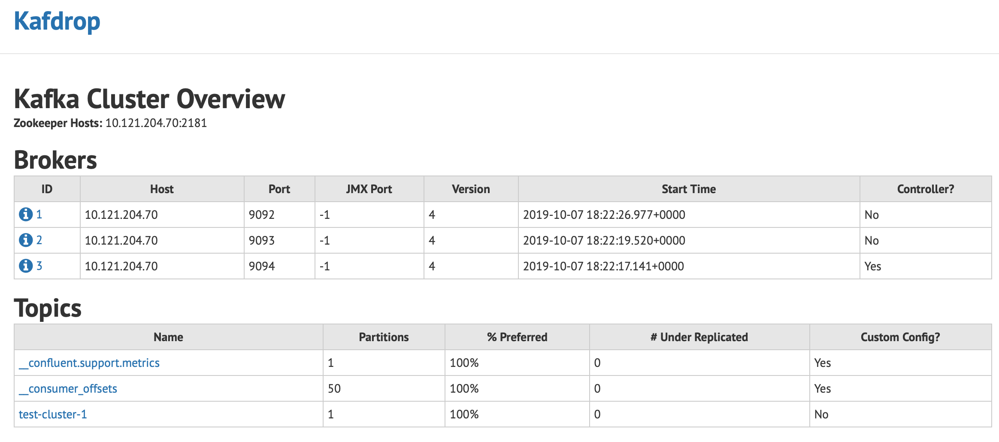
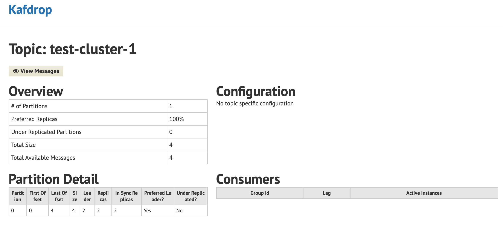
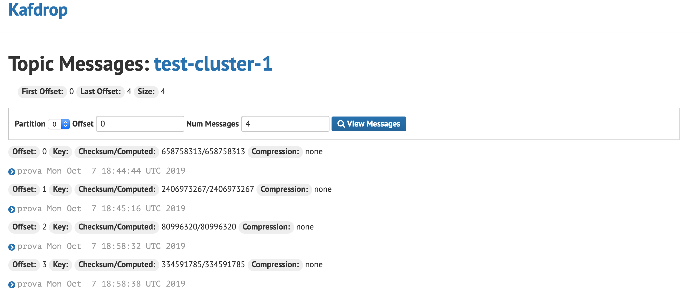

# Kafka: Creare un cluster Kafka con docker
### + 500 pt

## Setup Portainer
### ~ 10 min
Prima di entrare a piene mani sulla creazione del cluster kafka, andiamo ad introdurre un'interfaccia di gestione grafica (frontend) per docker che ci facilita nelle interazioni. 
Docker e' una tecnologia che permette di rendere le applicazioni facilmente distribuibili e funzionanti in brevissimo tempo, senza gli oneri di installazione e configurazione che hanno sempre richiesto ore di lavoro di tipo sistemistico.
Portainer e' un applicazione che permette di gestire le operazioni verso un docker engine, e si puo' avviare in pochi comandi attraverso docker. 
Tutto quello che serve per eseguire un applicazione in docker consiste in:
- un immagine dell'applicazione (reperibile su dockerhub)
- eseguire un comando docker per impostare qualche variabile di ambiente o volume per configurare l'applicazione
Una volta eseguiti questi passaggi per deployare Portainer, si potra' operare in futuro attraverso un interfaccia grafica web.
I passaggi per deployare Portainer possono cambiare in funzione del sistema operativo su cui e' installato Docker. Per i dettagli di tutti gli ambienti supportati, fare riferimento a: 
[Deployment Portainer](https://portainer.readthedocs.io/en/stable/deployment.html):fire: 
Di seguito un esempio per deployare portainer su un ambiente Linux.
```
$ docker volume create portainer_data
$ docker pull portainer/portainer:latest
$ docker run -d -p 9000:9000 --name portainer --restart always -v /var/run/docker.sock:/var/run/docker.sock -v portainer_data:/data portainer/portainer
```
Da questo momendo e' possibile accedere a portainer puntando da browser l'indirizzo ip su cui e' attivo docker alla porta 9000 (o quella configurata al momento del docker run)

------------------------------
## Introduzione a docker-compose
### ~ 15 min
Come abbiamo appena visto, tramite pochi semplici comandi docker e' possibile deployare un'applicazione, ma se avessimo a che fare con tecnologie complesse e articolate, potremmo avere necessita' di deployare gruppi di applicazioni che interagiscono tra loro.
Eseguire i singoli passaggi tramite ripetizione di comandi docker e' sicuramente una possibilita' che permette di prendere possesso della tecnologia, ma per questioni di velocita', una volta preso possesso della tecnologia, si puo' ricorrere all'utilizzo di docker-compose.
**docker-compose** e' un comando che permette di deployare rapidamente un gruppo di applicazioni, che sono state prima descritte accuratamente attraverso un file YAML. 
 
docker-compose non fa parte dell'installazione base di docker, ma e' installabile seguendo le istruzioni al link di seguito. [Install Docker Compose](https://docs.docker.com/compose/install/) :fire:
Per approfondimenti su compose file si faccia riferimento a: [Compose file version 2 reference](https://docs.docker.com/compose/compose-file/compose-file-v2/) :fire:
```
Nota:
Il link riporta informazioni sulla versione 2 di file compose perche' al momento e' l'unica supportata tramite portainer. 
Per chi non dovesse operare tramite portainer e' possibile utilizzare l'ultima versione. 
```
La sezione di portainer che consente di operare attraverso docker-compose si trova alla sezione "Stacks" dal menu di sinistra (necessaria una versione recente di portainer come la 1.21.0)
## Descrizione servizi per Kafka Cluster su file YAML
### ~ 10 min
Entrando tramite portainer, dalla sezione "Stacks", e' possibile accedere alla sezione "Create stack" dove e' disponibile un editor di test web dove dichiarare il nome e i servizi da deployare su docker.
In particolare, i servizi che andremo a dichiarare nella prima versione del file yaml sono:
- zookeeper (servizio necessario a kafka per distribuzione delle configurazioni dei broker)
- broker-kafka (uno o piu' broker che costituiscono il cluster kafka)

Il file yaml sara' quindi composto come sotto:
```
version: "2"

services:
  zookeeper:
    image: confluentinc/cp-zookeeper
    ports:
      - "2181:2181"
    environment:
      ZOOKEEPER_SERVER_ID: "1"
      ZOOKEEPER_CLIENT_PORT: "2181"
      ZOOKEEPER_TICK_TIME: "2000"
    restart: unless-stopped
  kafka-1:
    image: confluentinc/cp-kafka
    depends_on:
      - zookeeper
    ports:
      - "9092:9092"
    volumes:
      - /kafkadata/1:/var/lib/kafka/data
    restart: unless-stopped
    environment:
      KAFKA_ZOOKEEPER_CONNECT: "10.121.204.70:2181"
      KAFKA_BROKER_ID: "1"
      KAFKA_ADVERTISED_LISTENERS: "PLAINTEXT://10.121.204.70:9092"
      KAFKA_SOCKET_REQUEST_MAX_BYTES: 50000012
      KAFKA_MESSAGE_MAX_BYTES: 50000012
  kafka-2:
    image: confluentinc/cp-kafka
    depends_on:
      - zookeeper
    ports:
      - "9093:9093"
    volumes:
      - /kafkadata/2:/var/lib/kafka/data
    restart: unless-stopped
    environment:
      KAFKA_ZOOKEEPER_CONNECT: "10.121.204.70:2181"
      KAFKA_BROKER_ID: "2"
      KAFKA_ADVERTISED_LISTENERS: "PLAINTEXT://10.121.204.70:9093"
      KAFKA_SOCKET_REQUEST_MAX_BYTES: 50000012
      KAFKA_MESSAGE_MAX_BYTES: 50000012
  kafka-3:
    image: confluentinc/cp-kafka
    depends_on:
      - zookeeper
    ports:
      - "9094:9094"
    volumes:
      - /kafkadata/3:/var/lib/kafka/data
    restart: unless-stopped
    environment:
      KAFKA_ZOOKEEPER_CONNECT: "10.121.204.70:2181"
      KAFKA_BROKER_ID: "3"
      KAFKA_ADVERTISED_LISTENERS: "PLAINTEXT://10.121.204.70:9094"
      KAFKA_SOCKET_REQUEST_MAX_BYTES: 50000012
      KAFKA_MESSAGE_MAX_BYTES: 50000012
```

Definito lo YAML, il nome dello stack (nel nostro caso "kafkacluster"), procendendo su "Deploy Stack" e il cluster sara' creato.

## Modifica dello stack "clusterkafka" per Kafdrop
### ~ 5 min
Per essere agevolati nella verifica di quanto prodotto fino ad ora, andiamo a modificare lo stack "clusterkafka" aggiungendo un nuovo servizio.
Kafdrop e' un servizio che mette a disposizione un interfaccia grafice web per visualizzare metadati relativi al cluster kafka e il contenuto dei topic Kafka.
Il nuovo servizio puo' essere deployato nello stack appena creato, e' infatti possibile modificare il file yaml tramite "Editor" dalla sezione "Stacks" selezionando "kafkacluster".
Aggiungere la dichiarazione del nuovo servizio assicurandosi che lo yaml sia come quanto riportato sotto e selezionare "Update the stack".
```
version: "2"

services:
  zookeeper:
    image: confluentinc/cp-zookeeper
    ports:
      - "2181:2181"
    environment:
      ZOOKEEPER_SERVER_ID: "1"
      ZOOKEEPER_CLIENT_PORT: "2181"
      ZOOKEEPER_TICK_TIME: "2000"
    restart: unless-stopped
  kafka-1:
    image: confluentinc/cp-kafka
    depends_on:
      - zookeeper
    ports:
      - "9092:9092"
    volumes:
      - /kafkadata/1:/var/lib/kafka/data
    restart: unless-stopped
    environment:
      KAFKA_ZOOKEEPER_CONNECT: "10.121.204.70:2181"
      KAFKA_BROKER_ID: "1"
      KAFKA_ADVERTISED_LISTENERS: "PLAINTEXT://10.121.204.70:9092"
      KAFKA_SOCKET_REQUEST_MAX_BYTES: 50000012
      KAFKA_MESSAGE_MAX_BYTES: 50000012
  kafka-2:
    image: confluentinc/cp-kafka
    depends_on:
      - zookeeper
    ports:
      - "9093:9093"
    volumes:
      - /kafkadata/2:/var/lib/kafka/data
    restart: unless-stopped
    environment:
      KAFKA_ZOOKEEPER_CONNECT: "10.121.204.70:2181"
      KAFKA_BROKER_ID: "2"
      KAFKA_ADVERTISED_LISTENERS: "PLAINTEXT://10.121.204.70:9093"
      KAFKA_SOCKET_REQUEST_MAX_BYTES: 50000012
      KAFKA_MESSAGE_MAX_BYTES: 50000012
  kafka-3:
    image: confluentinc/cp-kafka
    depends_on:
      - zookeeper
    ports:
      - "9094:9094"
    volumes:
      - /kafkadata/3:/var/lib/kafka/data
    restart: unless-stopped
    environment:
      KAFKA_ZOOKEEPER_CONNECT: "10.121.204.70:2181"
      KAFKA_BROKER_ID: "3"
      KAFKA_ADVERTISED_LISTENERS: "PLAINTEXT://10.121.204.70:9094"
      KAFKA_SOCKET_REQUEST_MAX_BYTES: 50000012
      KAFKA_MESSAGE_MAX_BYTES: 50000012
  kafdrop:
    image: thomsch98/kafdrop:latest
    depends_on:
      - zookeeper
    ports:
      - "10000:9000"
    restart: unless-stopped
    environment:
      ZK_HOSTS: "10.121.204.70:2181"
```
In pochissimo tempo, il nuovo servizio sara' raggiungibile puntando il browser sulla porta 10000 dell'indirizzo IP della macchina dove e' stato deployato lo stack.
## Test Cluster Kafka

Ora che il cluster kafka e' creato, andiamo a testare le funzionalita' di base interagendo sui topic.
#### Test Scrittura su topic - Producer
##### 10 min
In questa sezione andremo ad interagire con una scrittura su topic, senza pero' entrare nei dettagli su come e' stato creato e con che criteri. Con le impostazioni di default di kafka, i topic vengono creati in automatico con i parametri di sistema e sono immediatamente disponibili per letture e scritture.
Per effetturare una scrittura su topic, utilizzeremo uno strumento da riga di comando chiamato: **kafka-console-producer**
Tale comando e' disponibile in qualunque distribuzione di Kafka (archivio zip con server Kafka, all'interno della cartella bin), ma in questo test useremo una versione contenuta in un immagine di docker.
Tramite riga di comando, utilizziamo un immagine di kafka (contenente tutto l'occorrente) eseguendola con l'override del comando principale, nello specifico andremo ad eseguire una bash invece che l'entrypoint di default che farebbe avviare un server kafka.
```
$ docker run -it --rm confluentinc/cp-kafka bash
``` 
Da questo momento vedremo a terminale l'esecuzione di una bash direttamente dentro il container appena creato.
Eseguendo il comando 
``` $ whereis kafka-console-producer ```
osserveremo un output simile a:
``` kafka-console-producer: /usr/bin/kafka-console-producer ```
 
 Per scrivere un messaggio su un topic di test chiamato per questo esempio **test-cluster-1** e' possibile lanciare il comando:
 ```
$ echo "prova `date`" | kafka-console-producer --broker-list 10.121.204.70:9092,10.121.204.70:9093,10.121.204.70:9094 --topic test-cluster-1
 ```
#### Test lettura da topic - Consumer
##### 10 min
Seguendo la modalita' operativa appena utilizzata per la scrittura, utilizziamo il comando **kafka-console-consumer** per consumare i contenuti prodotti sul topic.
La prima volta, come default, il consumer parte a visualizzare contenuti sul topic, a partire dal momento della connessione, per cui dopo aver eseguito il comando riportato sotto, ripetere da un altra bash il comando del producer.
```
$ kafka-console-consumer --bootstrap-server 10.121.204.70:9092,10.121.204.70:9093,10.121.204.70:9094 --topic test-cluster-1
```
Fino a che non sara' eseguito di nuovo il producer, il comando del consumer rimane bloccato in attesa di contenuti da visualizzare.
#### Visualizzazione cluster kafka tramite Kafdrop
##### 10 min
Accedendo alla webapp di Kafdrop pubblicata sulla porta 10000 tramite la dichiarazione sul file yaml, e' possibile visualizzare informazioni legate allo stato del cluster kafka e dei topic, in riferimento ai metadati di quest'ultimo e ai contenuti.
Aprendo la home page di kafdrop si visualizzano subito i broker presenti sul cluster e i topic.



Cliccando sul topic **test-cluster-1** si visualizzano le informazioni relative ai metadati del topic.



Entrando nella sezione **View Messages** e' possibile specificare partizione, offset di partenza e numero di messaggi da visualizzare.



