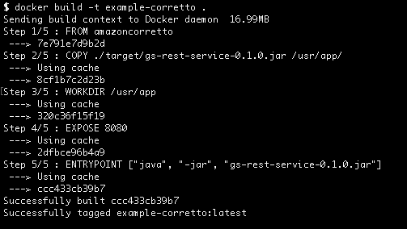
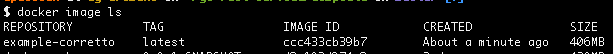
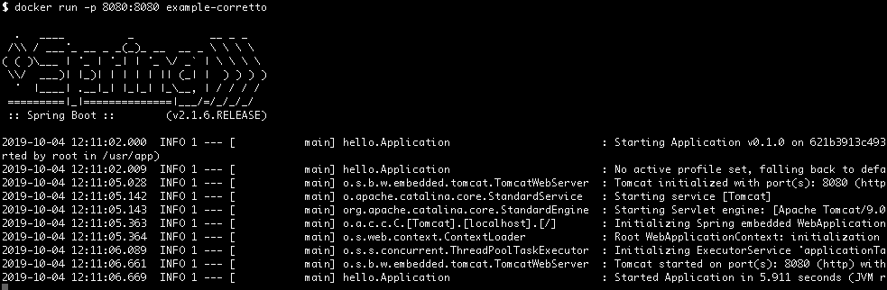
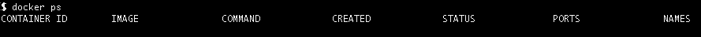

# Docker: creare un container per esercire un'applicazione Java
### + 300 pt
## Setup Docker
### ~ 15 min
Per prima cosa, nel caso non avessimo Docker installato sulla nostra macchina, dovremo scaricarlo ed installarlo. Docker è disponibile per tutte le piattaforme, qui di seguito scegliere il link adatto al proprio sistema
* [Installare Docker su Mac](https://docs.docker.com/docker-for-mac/)
* [Installare Docker su Windows](https://docs.docker.com/docker-for-windows/)

È assolutamente possibile anche installare Docker su sistemi Linux, in questo caso però fare riferimento alla documentazione della distribuzione utilizzata.

:fire: _Cos'è [Docker](https://www.youtube.com/watch?v=JSLpG_spOBM)_

## Creare un servizio Spring Boot di test
### ~ 10-50 min
Creiamo ora un semplice servizio Spring Boot di cui andremo a fare il deploy all'interno del nostro container
#### Che cosa realizzeremo
Riguardo le istruzioni da seguire per la realizzazione del servizio si faccia riferimento al tutorial [Creare un servizio Spring Boot](./createspringbservice.md)
## Creiamo il nostro Dockerfile
### ~ 10 min
Per iniziare, posizioniamoci nella cartella principale del nostro progetto e creiamo un nuovo file di testo chiamato Dockerfile. Conterrà tutti i passaggi necessari per creare un'immagine (come i passaggi in una ricetta alimentare). Per la nostra applicazione sarà simile al seguente:
```
FROM amazoncorretto
COPY ./target/gs-rest-service-0.1.0.jar /usr/app/
WORKDIR /usr/app
EXPOSE 8080
ENTRYPOINT ["java", "-jar", "gs-rest-service-0.1.0.jar"]
```
Cosa significano queste linee che abbiamo appena scritto? Vediamo insieme nel dettaglio:
* `FROM amazoncorretto` - con questo comndo diciamo a **Docker** che la nostra immagine sarà basata su un'altra immagine disponibile sul repository pubblico (**Docker Hub**). Questa immagine è stata preparata da qualcun altro e contiene tutte le dipendenze necessarie di cui avremmo bisogno per eseguire qualsiasi applicazione Java. Nel nostro caso l'immagine di base, da cui partiremo, sarà [amazoncorretto](https://hub.docker.com/_/amazoncorretto).
* `COPY ./target/gs-rest-service-0.1.0.jar /usr/app/` - com'è intuibile, con questo passaggio, copieremo il nostro file **JAR**, ma dove? Il primo argomento dopo `COPY` è il percorso del file **JAR** sul nostro filesystem locale. Il secondo parametro, `/usr/app/` , è la directory all'nterno del **Container** in cui inseriamo la nostra applicazione.
* `WORKDIR /usr/app` - **Docker**, con l'istruzione `WORKDIR` viene istruito del fatto di utilizzare la cartella `/usr/app` come cartella di lavoro, in caso contrario ad ogni comando successivo avremmo dovuto fornire il percorso completo della risorsa.
* `EXPOSE 8080` - con questa istruzione esponiamo sul **Container** la stessa posta utilizzata dalla nostra applicazione.
* `ENTRYPOINT ["java", "-jar", "gs-rest-service-0.1.0.jar"]` - in quest'ultimo comando stiamo istruendo **Docker** per eseguire la nostra applicazione, nell'array di valori passati al comando il primo rappresenta il comando vero e proprio da eseguire, mentre gli ultimi due sono parametri.
## Creiamo il nostro container
### ~ 20 min
Una volta terminato il nostro Dockerfile, posizioniamoci nella cartella dov'è contenuto quest'ultimo e lanciamo la compilazione dell'immagine
```
$ docker build -t example-corretto .
```
quello che otterremo sarà qualcosa di simile



il prossimo passo sarà assicurarci che la nostra immagine sia stata creata e sia disponibile localmente
```
$ docker image ls
```



non ci resta che creare il nostro vero e proprio **Container** istanziando l'immagine appena creata

```
$ docker run -p 8080:8080 example-corretto
```



Con quest'ultimo comando abbiamo istruito **Docker** ad istanziare l'immagine `example-corretto` pubblicando la porta del container associandola con una porta dell'host
```
$ docker run -p <porta host>:<porta esposta nel Dockerfile> <immagine>
```
## Testiamo il tutto
### ~ 5 min
Ora che il servizio è attivo all'interno del nostro **Container** digitiamo l'indirizzo `http://localhost:8080/greeting` dove vedremo
```json
{"id":1,"content":"Hello, World!"}
```
Aggiungendo e valorizzando il parametro `name` alla query-string `http://localhost:8080/greeting?name=User` potremmo vedere come il contenuto della risposta cambierà:
```json
{"id":2,"content":"Hello, User!"}
```
Terminiamo l'esecuzione del **Container** premendo, nel terminale, la combinazione di tasti `Ctrl c`. Per verificare che il nostro container si sia effettivamente stoppato digitare
```
$ docker ps
```
il risultato dovrebbe essere il seguente



A questo punto ricreiamo il nostro container ma modificando la posta sul nostro host

```
$ docker run -p 80:8080 example-corretto
```

reinvocando l'url con la nuova porta `http://localhost/greeting` il risultato non dovrebbe essere cambiato

```json
{"id":1,"content":"Hello, World!"}
```

