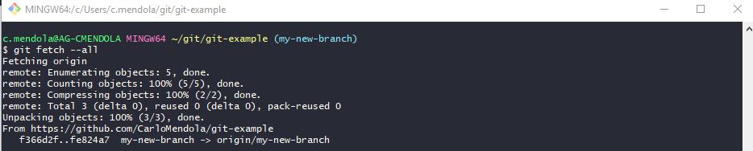

# GIT: una panoramica dalla command line
### + 350 pt

## GIT: il controllo di versione distribuito
### ~ 5 min
Git e' un sistema di controllo di versione distribuito organizzato a repository.
Ciascun repository e' presente in un server centrale (e.g. github, gitlab, ...), di solito in un formato chiamato **bare**, che non permette di visualizzare a filesystem i file versionati, ma che e' clonabile da chiunque ne faccia richiesta e abbia i permessi per accedere.
L'accesso ai repository centrale git puo' essere effettuato nei seguenti modi:
- interazione via file 
- interazione via ssh
- interazione via http/https
Dal momento che il repository centrale viene clonato, ciascuno dei cloni ha una versione completa del repository (di tutti i file in tutti i branch e tutte le versioni), e alla fine del proprio lavoro, il delta prodotto rispetto al repository di partenza deve essere pushato sul repository centrale, eventualmente riconciliando i conflitti che possono essersi creati.

Per approfondire le modalita' di creazione di un server git fare riferimento a [Git on the server](Git-on-the-Server-Getting-Git-on-a-Server) :fire:

## Setup Git Bash
### ~ 10 min
Prima di muovere i primi passi sulla commandline di Git e' necessario installare gli eseguibili di git.
- Per scaricare GIT fare riferimento alla pagina [Git Download](https://git-scm.com/downloads)
Se l'ambiente scelto per l'installazione e' Windows, il package di installazione per questo sistema operativo include anche la **git-bash**, un emulatore di terminale unix ove e' possibile eseguire git da riga di comando.

Per validare l'ambiente appena installato, aprire la gitbash ed eseguire il comando:
```git --version```


## GIT: le operazioni piu' usate viste dalla command line
### ~ 45 min

#### Clone repository remoto
Per clonare un repository remoto e' necessario posizionarsi nella cartella di lavoro e eseguire dalla gitbash il comando:
``` git clone https://github.com/CarloMendola/git-example.git ```


Da questo momento, entrando nella cartella git-example si puo' operare sul repository locale.

#### Creazione branch locale e remoto
Per creare un branch e selezionarlo e' sufficiente eseguire il comando: 
``` git checkout -b my-new-branch ```

Come detto in precedenza, essendo git un software completamente distribuito, tutte le operazioni effettuate sul repository locale, sono disaccoppiate dal repository remoto.
Per tanto, se non esegui esplicitamente un operazione di push del branch locale appena creato, questo non esistera' mai sul repository remoto.

Per eseguire la push, si esegue il comando:
``` git push origin my-new-branch ```

Con la keyword **origin** si intende il riferimento remoto del server da cui il repository e' stato clonato.
Per approfondire sul significato di **origin**, fare riferimento a [Git Basics Working with Remotes](https://git-scm.com/book/en/v2/Git-Basics-Working-with-Remotes) :fire:

In alcuni casi, lavorare ad un repository con piu' di un server remoto e' necessario, il caso di esempio che molti conosceranno e' GitHub, dove in maniera istantanea si possono creare fork di progetti altrui. 
Per tenerli allineati nel tempo e' necessario utilizzare un doppio riferimento remoto sul progetto forkato per mantenerlo aggiornato rispetto al progetto di partenza. Per approfondimenti sul modello fork di github fare riferimento a [Fork a Repo](https://help.github.com/en/articles/fork-a-repo) :fire:


#### Aggiornamento metadati repository da remoto
Uno dei comandi che viene usato molto spesso dagli sviluppatori, a volte in maniera trasparente dagli IDE grafici come Eclipse, VisualStudio, ecc... e' il **fetch**, un operazione che consente di recuperare i metadati remoti del repository.
Il caso d'uso tipico per cui viene utilizzato questo comando, consiste nel gestire le modifiche parallele ad un repository (quando piu' persone lavorano sullo stesso repository ed effettuano **push** delle loro modifiche locali in remoto).
Eseguendo il fetch, e' possibile capire se la propria baseline (versione di partenza clonata dal repository centrale) e'diventata obsoleta e deve essere ribasata.
Eseguendo il comando fetch, e' possibile avere un idea delle operazioni necessarie per procedere.
``` git fetch --all ```



In questo caso si puo' osservare che il fetch segnala una modifica remota, a questo punto l'utente puo' scegliere se ribasarsi subito o continuare il proprio lavoro posticipando il rebase. Per poter rientrare con le proprie modifiche sul server remoto, le modifiche locali devono includere tutte quelle introdotte da altri sviluppatori in remoto tramite rebase o merge.

#### Visualizzazione testuale delle versioni del repository
Per visualizzare tramite gitbash il version-tree completo del repository e' necessario eseguire il comando:
``` git log --all --graph --oneline ```


Dall'immagine si puo' vedere che in questo caso, il repository locale seleziona il branch my-new-branch (vedi puntatore **HEAD**), che pero' e' meno aggiornato di quanto disponibile sul repository remoto.

Per riallineare le modifiche locali a quelle remote si puo' procedere in 2 modi, tramite **Merge** o **Rebase**.

Ove possibile e' sempre meglio procedere tramite rebase del proprio branch locale (riscrittura del proprio branch locale a partire da una nuova baseline). Il beneficio di perseguire questa modalita', consiste nell'avere modo di provare le proprie modifiche dopo il rebase prima del push in remoto.

Per effettuare il rebase (in modalita' FastForward) si utilizza il comando:
``` git pull --rebase --ff-only origin my-new-branch ```


Eseguendo nuovamente il comando per visualizzare il version-tree (git log) e' possibile osservare lo spostamento del puntatore **HEAD**

**NOTA:** il puntatore *HEAD* permette di selezionere (visualizzare) a filesystem una precisa versione (commit, branch, tag, ecc..) del repository. ::


#### Visualizzazione Differenze tra versioni
Per visualizzare tramite command line quali sono le differenze nei contenuti dei file tra 2 versioni, si puo' eseguire il comando:
``` git diff f366d2f fe824a7 ```


Quella sopra e' solo una delle tante modalita' in cui si puo' interagire con git diff, per approfondire le altre modalita' fare riferimento a [Git Diff](https://git-scm.com/docs/git-diff) :fire:

#### Modifiche al repository e commit
Quando si lavora ad un repository, di solito, e' buona norma conoscere il branch principale dove far confluire le modifiche a fine lavoro, quindi lavorare sempre su un proprio branch di sviluppo.
Le modifiche che saranno versionate su git con l'operazione di **commit** sono rappresentabili come un elenco di diff per ciascun file interessato rispetto al commit precedente.
Su Git, un file selezionato ad una certa versione, e' composto internamente dal commit iniziale con applicate tutte le modifiche in maniera differenziale fino alla sua ultima modifica.
#### Merge 
Quando si creano delle modifiche su un branch, prima o poi si vorranno riportare quei commit sul branch o baseline di partenza, e l'operazione necessaria per portare a termine quest'operazione e' il **merge**.
Ci sono 2 modalita' di merge possibili:
- FastForward (--ff o --ff-only)
    In questo caso il branch deve essere posizionato in testa rispetto alla baseline (in caso contrario serve un **rebase**), e l'operazione di merge si concretizza spostando il riferimento del branch della baseline sul riferimento del branch di sviluppo **senza creare un nuovo commit**.
- Non FastForward (--no-ff)
    In questo caso il branch di sviluppo resta al suo posto e viene sempre prodotto un nuovo commit di merge con tutte le diff cumulative dei commit sul branch di sviluppo.
    Il merge non FastForward puo' essere fatto in qualunque circostanza, ma ha lo svantaggio che e' piu' soggetto a conflitti (dovuti al fatto che non e' necessario un rebaase prima di procedere).

In caso di conflitti, le operazioni di merge (vale anche per il rebase), sono soggette ad interazioni manuali tramite editor testuale, per la risuluzione puntuale.

#### Tag
Tutte le volte che si finalizza un rilascio software, e' possibile posizionare un **tag** associato ad un determinato commit (hash sha1).
I comandi necessari per associare un tag ad un qualunque commit esistente (anche non selezionato con il puntatore HEAD) sono:
``` git tag TAG1 f366d2f  ```
``` git tag TAG2  fe824a7 ```
Come succede per i commit e i branch, una volta creati, i tag, restano locali al repository.
Per propagarli anche sul repository remoto serve un operazione di push.
``` git push origin --tags ```


Una volta creati, i tag sono selezionabili come si puo' fare con branch e commit tramite il comando git checkout, utilizzando la modalita' **detached HEAD** di git. 
Se vengono prodotte modifiche a partire da un commit in modalita' detached HEAD, e' sempre consigliabile applicare un riferimento a quest'ultimo (branch o tag) **prima** di selezionare un'altra versione con il comando git chechout. Se l'operazione descritta in precedenza non viene effettuata, il commit non viene tracciato dal comando che visualizza il version tree completo del repository. In ogni caso, fino a che non si elimina il repository locale e' possibile recuperarlo selezionandone l'hash tracciato dall'output del comando **git reflog**. 
Per approfondimento su git reflog vedi [Git Reflog](https://git-scm.com/docs/git-reflog) :fire:

#### Mistakes with Git
TODO: force